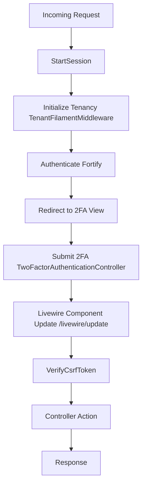

# Piano di Risoluzione: CSRF 419 Error nel Login con 2FA

## Panoramica
**Problema**: Il login con doppia autenticazione (2FA) attivata per l'utente admin@test.com restituisce errore 419 CSRF. L'errore si verifica sulle richieste POST `/livewire/update` durante il submit del form di login Filament.

**Root Cause**: L'inizializzazione del tenant tramite `InitializeTenancyBySubdomain` avviene DOPO che la sessione è stata avviata, causando un cambio del session ID e invalidando il token CSRF generato prima del tenant switch.

**Soluzione**: Riordinare la middleware pipeline per garantire che l'inizializzazione del tenant avvenga PRIMA dell'avvio della sessione, mantenendo la validazione CSRF attiva per tutte le route.

---

## Step 1: Riprodurre l'errore 419 CSRF in ambiente controllato

### Azione
Confermare le condizioni esatte del bug raccogliendo log e request/response headers.

### Reasoning
Confermare le condizioni del bug evita di inseguire problemi inesistenti e fornisce log utili per guidare il fix.

### Dettagli Implementazione
1. Usare il database SQLite di sviluppo
2. Creare un tenant (es. `test.localhost`)
3. Creare utente `admin@test.com` con 2FA abilitato tramite UI Filament
4. Aprire finestra incognito, navigare a `/admin/login`
5. Inserire credenziali e sottomettere
6. Quando richiesto, inserire codice TOTP corretto
7. Osservare nel network tab la richiesta POST a `/livewire/update` che restituisce HTTP 419
8. Catturare request/response headers completi e log Laravel (`storage/logs/laravel.log`)

### Error Handling
- Se l'errore non appare, verificare che il middleware tenant sia attivo
- Assicurarsi che `APP_DEBUG=true` in `.env` per log dettagliati
- Verificare session driver (`SESSION_DRIVER=file` o `cookie`)

### Testing
Creare test automatico (Dusk o PHPUnit HTTP) che segue gli stessi step e asserisce che viene ritornato status 419 quando 2FA è attivo.

---

## Step 2: Mappare la pipeline middleware corrente per Filament, Livewire e route 2FA

### Azione
Comprendere l'ordine dei middleware per identificare dove la sessione (e quindi il token CSRF) viene rigenerata o persa.

### Reasoning
Capire l'ordine dei middleware rivela dove il session ID viene rigenerato, specialmente in contesto multi-tenant.

### Dettagli Implementazione
1. Aprire `bootstrap/app.php` e notare i middleware group globali
2. Revisionare `routes/web.php`, `routes/tenant.php` e route group Filament
3. Elencare lo stack middleware esatto che processa il POST login e il POST 2FA successivo
4. Creare diagramma Mermaid per visualizzare il flusso

### Diagramma Flusso Middleware Attuale



### Error Handling
Flaggare per review se un middleware custom sovrascrive `StartSession` o `VerifyCsrfToken`.

### Testing
Usare `php artisan route:list --name=login` per confermare assegnazioni middleware.

### Tip
Documentare il diagramma ora; sarà riutilizzato per spiegare il fix al team.

---

## Step 3: Assicurare che l'inizializzazione tenant avvenga PRIMA dell'avvio sessione

### Azione
Spostare i middleware di inizializzazione tenant PRIMA di `StartSession` nella pipeline `web`.

### Reasoning
Il token CSRF è memorizzato nella sessione. Se il middleware tenant (che può switchare la connessione DB e rigenerare il session ID) gira dopo `StartSession`, il token generato per l'app centrale non corrisponderà alla sessione tenant-scoped, causando 419.

### Dettagli Implementazione
1. In `bootstrap/app.php`, aggiungere middleware tenant con `prepend` PRIMA di `StartSession`:
   ```php
   ->withMiddleware(function (Middleware $middleware): void {
       $middleware->web(prepend: [
           \App\Http\Middleware\TenantInitialization::class, // nuovo wrapper
       ]);
   })
   ```

2. Creare nuovo middleware wrapper `TenantInitialization` che chiama la catena tenant-specific mantenendo le classi originali intatte

3. Verificare che il tenant sia risolto correttamente da subdomain o header PRIMA che il cookie di sessione sia letto/scritto

4. Pulire cache middleware:
   ```bash
   php artisan config:clear
   php artisan route:clear
   ```

### Error Handling
- Se spostare il middleware rompe altre parti dell'app, aggiungere check condizionali
- Loggare il tenant ID all'inizio della richiesta per confermare risoluzione corretta

### Testing
- Ri-eseguire step di riproduzione da Step 1
- Il POST a `/livewire/update` dovrebbe ora restituire 200
- Aggiungere test PHPUnit che asserisce il token CSRF nella sessione corrisponde al token inviato nella richiesta Livewire dopo inizializzazione tenant

### Tip
Incapsulare tenant init nel suo middleware mantiene i middleware originali Filament/Livewire intatti, riducendo rischio regressioni.

---

## Step 4: Rimuovere esclusioni CSRF insicure per `livewire/*` e `2fa/*`

### Azione
Eliminare le esclusioni CSRF temporanee che mascherano il problema reale.

### Reasoning
Livewire già incorpora un token CSRF fresco in ogni richiesta componente. Escludere queste route vanifica la protezione Laravel e maschera il problema sottostante.

### Dettagli Implementazione
1. In `bootstrap/app.php`, rimuovere le esclusioni CSRF:
   ```php
   // RIMUOVERE:
   // $middleware->validateCsrfTokens(except: [
   //     'livewire/*',
   //     '2fa/*',
   // ]);
   ```

2. Eseguire `php artisan config:cache` per refreshare la configurazione middleware

### Error Handling
Dopo la rimozione, se 419 persiste, verificare che il token CSRF sia inviato nell'header `X-CSRF-TOKEN` o come campo `_token` (Livewire usa automaticamente l'header).

### Testing
Ri-eseguire il test Dusk/Feature da Step 1. La richiesta dovrebbe avere successo senza errori CSRF.

### Tip
Mantenere l'array `$except` vuoto a meno che non ci sia una ragione molto specifica e auditata per bypassare CSRF.

---

## Step 5: Aggiustare il flusso verifica 2FA per preservare il token CSRF attraverso i redirect

### Azione
Modificare il controller 2FA per preservare il token CSRF durante i redirect.

### Reasoning
L'implementazione 2FA di Fortify può eseguire un redirect completo dopo autenticazione password riuscita, il che può causare rigenerazione del session ID da parte di Laravel. Facendo flash esplicito del token CSRF o usando `->withCookie()` manteniamo il token stabile.

### Dettagli Implementazione
1. In `app/Http/Controllers/TwoFactorAuthenticationController.php`, dopo check password riuscito:
   ```php
   $request->session()->regenerate(); // mantieni questo
   $request->session()->put('_token', csrf_token()); // ri-memorizza token
   ```

2. Nella view che renderizza l'input TOTP (`resources/views/auth/two-factor/verify.blade.php`):
   ```blade
   <input type="hidden" name="_token" value="{{ csrf_token() }}">
   ```

3. Assicurarsi che il componente Livewire che gestisce il POST finale 2FA riceva anche il token via `wire:submit.prevent`

### Error Handling
Se la sessione è ancora rigenerata inaspettatamente, abilitare `SESSION_DRIVER=file` e disabilitare qualsiasi chiamata custom `Session::regenerate()` in altri middleware.

### Testing
Aggiungere Feature test che fa login, passa lo stage password, sottomette TOTP, poi fa richiesta Livewire a `/livewire/update` e asserisce risposta 200.

### Tip
Considerare uso di helper Laravel `withToken()` nei test per iniettare il token direttamente, evitando dipendenza da hidden inputs.

---

## Step 6: Aggiornare componente Livewire login per refreshare esplicitamente token CSRF dopo tenant switch

### Azione
Modificare il componente Livewire del login (se customizzato) per refreshare il token CSRF dopo il tenant switch.

### Reasoning
I componenti Livewire cacciano il token CSRF al mount. Dopo che il tenant è impostato, il token memorizzato nel componente può essere stale.

### Dettagli Implementazione
1. Localizzare componente login Livewire (es. `app/Livewire/Auth/LoginForm.php`)

2. Nel metodo `mount()`, dopo conferma contesto tenant:
   ```php
   $this->csrfToken = csrf_token(); // esponi alla view
   ```

3. Nella view Blade, bindare il token:
   ```blade
   <form wire:submit.prevent="authenticate">
       @csrf
       <!-- oppure -->
       <input type="hidden" name="_token" value="{{ $csrfToken }}">
   </form>
   ```

4. Assicurarsi che il componente re-inizializzi ad ogni richiesta

### Error Handling
Se il componente usa ancora un token vecchio, forzare full page reload dopo password stage (`return redirect()->route('2fa.verify');`) così Blade rigenera il token.

### Testing
Scrivere test Livewire che asserisce la view renderizzata contiene token fresco che corrisponde a `session('_token')`.

### Tip
Livewire 3 inietta automaticamente il token, ma gestione esplicita evita edge case quando l'ordine middleware è non-standard.

---

## Step 7: Eseguire test suite completo Laravel e aggiungere nuovi test case per il flusso corretto

### Azione
Assicurare nessuna regressione nell'applicazione, specialmente in contesti multi-tenant.

### Reasoning
Verificare che il fix non introduca regressioni è critico prima del merge.

### Dettagli Implementazione
1. Eseguire test esistenti: `php artisan test`

2. Aggiungere nuovi test:
   - **Feature** `LoginWith2FATest` – copre password entry, TOTP entry, e richiesta Livewire successiva
   - **Unit** `TenantMiddlewareTest` – asserisce tenant ID impostato prima dello start sessione
   - **Browser** (Dusk) `TwoFactorCsrfTest` – verifica UI-level della risoluzione del 419

3. Usare Laravel Pint per formattazione codice:
   ```bash
   vendor/bin/pint
   ```

### Error Handling
Se qualche test fallisce per cache stale, eseguire:
```bash
php artisan cache:clear
php artisan view:clear
```

### Testing
Tutti i nuovi test devono passare sia su SQLite (dev) che PostgreSQL (staging).

### Tip
Configurare GitHub Actions per eseguire questi test automaticamente ad ogni PR.

---

## Step 8: Aggiornare documentazione progetto per riflettere gestione CSRF corretta e ordine middleware

### Azione
Documentare il fix per futuri sviluppatori.

### Reasoning
Gli sviluppatori futuri hanno bisogno di una guida chiara sul perché l'ordine middleware è importante e perché le esclusioni CSRF devono rimanere vuote.

### Dettagli Implementazione
1. Modificare `docs/security.md` – aggiungere sezione "CSRF & Multi-Tenancy" spiegando:
   - Importanza di inizializzare tenancy prima della sessione
   - Stack middleware corretto (mostrare code snippet)
   - Rimozione eccezioni CSRF

2. Aggiornare `README.md` – aggiungere nota troubleshooting per "Login 419 errors with 2FA"

3. Committare cambiamenti con messaggio chiaro: `docs: add CSRF-tenant initialization guide`

### Error Handling
Verificare che la documentazione si compili correttamente con qualsiasi generatore di sito statico (se usato).

### Testing
Nessuno richiesto oltre ispezione visuale.

### Tip
Linkare la documentazione dalla wiki interna per migliorare discoverability.

---

## Riepilogo

Questo piano risolve il problema CSRF 419 nel login con 2FA attraverso una riorganizzazione strategica della middleware pipeline, assicurando che:

1. ✅ L'inizializzazione tenant avvenga PRIMA dello start sessione
2. ✅ I token CSRF rimangano validi attraverso il tenant switch
3. ✅ Non ci siano esclusioni CSRF insicure
4. ✅ Livewire funzioni correttamente in contesto multi-tenant
5. ✅ Il codice sia testato e documentato

**Approccio**: Security by Design - manteniamo la protezione CSRF attiva risolvendo il problema alla radice (ordine middleware) invece di mascherarlo con esclusioni.
