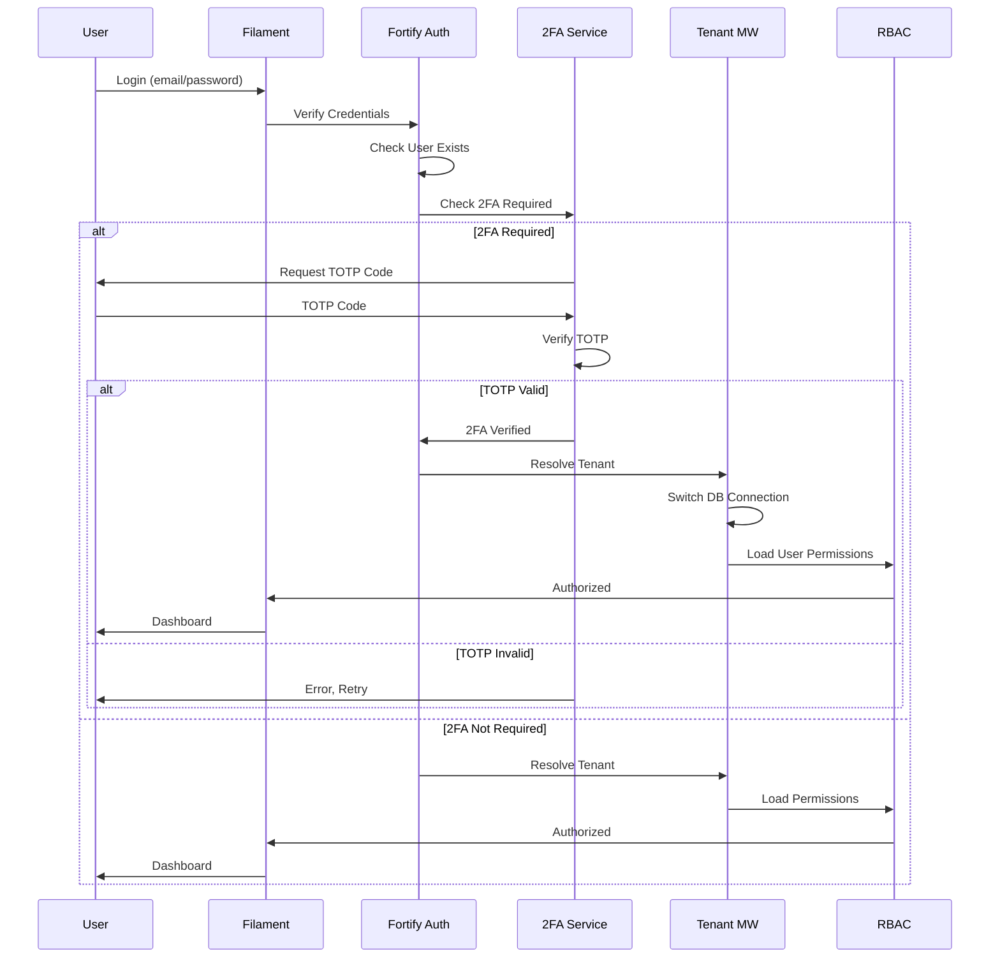
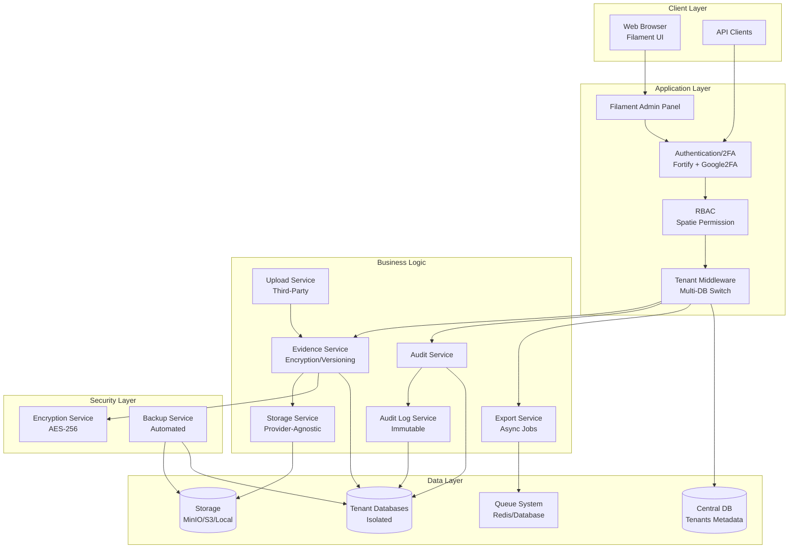
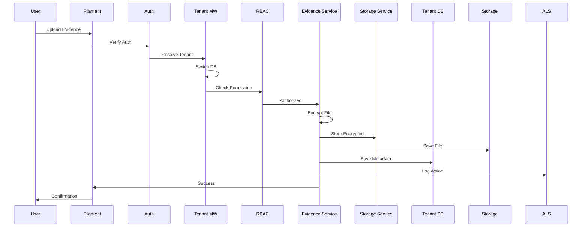

# AuditReady - Design Architetturale

## 1. Panoramica

Questo documento descrive l'architettura di alto livello della piattaforma AuditReady, un sistema multi-tenant per la gestione sicura di evidenze di audit con focus su sicurezza, privacy e compliance.

### 1.1 Principi Architetturali

- **Security by Design**: Ogni componente implementa controlli di sicurezza autonomi
- **Privacy by Design**: Minimizzazione dati, isolamento tenant, crittografia end-to-end
- **Defense in Depth**: Multipli livelli di sicurezza (network, application, data)
- **Least Privilege**: Accesso minimo necessario per ogni ruolo
- **Segregation of Duties**: Separazione responsabilità tra ruoli

### 1.2 Dichiarazione di Perimetro

AuditReady:
- ✅ Archivia evidenze
- ✅ Versiona documenti
- ✅ Struttura dati per audit
- ✅ Esporta evidenze

AuditReady NON:
- ❌ Valuta conformità
- ❌ Interpreta dati
- ❌ Fornisce consulenza legale
- ❌ Esegue scoring/rating

## 2. Architettura Multi-Tenant

### 2.1 Strategia Multi-Database

AuditReady utilizza un approccio **multi-database** dove ogni tenant (organizzazione cliente) ha il proprio database completamente isolato.

#### Vantaggi

- **Isolamento Completo**: Impossibile accesso cross-tenant anche con bug SQL
- **Compliance**: Allineato a GDPR, DORA, NIS2
- **Scalabilità**: Possibilità di scalare per tenant
- **Backup Mirati**: Backup/restore per singolo cliente
- **Performance**: Query più semplici (niente filtri tenant_id)

#### Architettura Database

```
┌─────────────────────────────────────────┐
│   Database Centrale (tenants)           │
│   - Metadati tenant                     │
│   - Configurazioni connessioni         │
│   - Domini e routing                    │
└─────────────────────────────────────────┘
              │
              │ Tenant Resolution
              │
    ┌─────────┼─────────┬─────────┐
    │         │         │         │
    ▼         ▼         ▼         ▼
┌───────┐ ┌───────┐ ┌───────┐ ┌───────┐
│Tenant1│ │Tenant2│ │Tenant3│ │TenantN│
│  DB   │ │  DB   │ │  DB   │ │  DB   │
└───────┘ └───────┘ └───────┘ └───────┘
```

#### Identificazione Tenant

Il sistema identifica il tenant corrente tramite:

1. **Sub-domain** (preferito): `cliente1.auditready.com`
2. **Header HTTP**: `X-Tenant-ID: {uuid}` (per API)
3. **Path Parameter**: `/api/tenant/{uuid}/...` (opzionale)

#### Gestione Connessioni

- **TenantConnectionResolver**: Switcha automaticamente la connessione DB
- **TenantBootstrapper**: Inizializza tenant context su ogni richiesta
- **Global Scope**: Nessun scope necessario (isolamento fisico)

## 3. Autenticazione e Autorizzazione

### 3.1 Flusso di Autenticazione



### 3.2 2FA TOTP Obbligatoria

- **Standard**: TOTP (RFC 6238)
- **Libreria**: `pragmarx/google2fa-laravel`
- **Compatibilità**: Microsoft Authenticator, Google Authenticator, Authy
- **Obbligatoria per**: Organization Owner, Audit Manager, Contributor
- **Storage**: Secret cifrati (AES-256) in database

### 3.3 Role-Based Access Control (RBAC)

#### Ruoli e Permessi

| Ruolo | Permessi Principali |
|-------|-------------------|
| **Organization Owner** | Gestione tenant, assegnazione ruoli, eliminazione organizzazione |
| **Audit Manager** | Creare/chiudere audit, visualizzare tutte evidenze, export |
| **Contributor** | Upload/modificare proprie evidenze, visualizzare stato audit |
| **Viewer** | Accesso read-only a evidenze |
| **External Uploader** | Upload limitato via API, nessuna visualizzazione |

#### Implementazione

- **Libreria**: `spatie/laravel-permission`
- **Policies**: Laravel Policies per ogni risorsa
- **Filament Integration**: Plugin Spatie Permission per UI

## 4. Architettura Storage

### 4.1 Storage Provider-Agnostic

AuditReady supporta multipli provider storage S3-compatibili configurabili via environment:

- **MinIO** (self-hosted, default produzione)
- **AWS S3** (Amazon Web Services)
- **DigitalOcean Spaces**
- **Wasabi**
- **Backblaze B2**
- **Storage Locale** (sviluppo/test)

#### StorageService Layer

```php
// Codice applicativo usa sempre StorageService
StorageService::put($path, $encryptedContent);
StorageService::get($path);
StorageService::delete($path);

// Provider è trasparente, configurato via STORAGE_PROVIDER env
```

### 4.2 Crittografia File

#### Processo di Cifratura

1. **Upload**:
   ```
   File Plaintext
        ↓
   Genera chiave AES-256 random per file
        ↓
   Cifra file con chiave
        ↓
   Cifra chiave con app key Laravel
        ↓
   Store file cifrato + chiave cifrata (in DB)
   ```

2. **Download**:
   ```
   Recupera file cifrato + chiave cifrata
        ↓
   Decifra chiave con app key Laravel
        ↓
   Decifra file con chiave
        ↓
   Stream file plaintext all'utente
   ```

#### Isolamento per Tenant

```
storage/
├── tenants/
│   ├── {tenant-uuid-1}/
│   │   ├── evidences/
│   │   │   ├── {evidence-uuid}_v1
│   │   │   ├── {evidence-uuid}_v2
│   │   │   └── ...
│   │   └── exports/
│   │       └── {audit-id}_{timestamp}.pdf
│   └── {tenant-uuid-2}/
│       └── ...
└── backups/
    └── ...
```

## 5. Gestione Evidenze

### 5.1 Versioning

- **Nessuna sovrascrittura**: Ogni modifica genera nuova versione
- **Versioni accessibili**: Tutte le versioni rimangono disponibili
- **Metadata in DB**: Tabella `evidences` con campo `version`
- **Storage**: File con naming `{uuid}_v{version}`

### 5.2 Integrità

- **Checksum SHA-256**: Calcolato su plaintext prima della cifratura
- **Verifica download**: Confronto checksum dopo decrittazione
- **Audit trail**: Tracciamento di ogni operazione

## 6. Audit Trail Immutabile

### 6.1 Design

- **Tabella**: `audit_logs` (append-only)
- **Firma**: HMAC-SHA256 per ogni entry
- **Immutabilità**: Nessun UPDATE/DELETE permesso
- **Tenant Isolation**: Log separati per tenant

#### Struttura Log Entry

```php
[
    'id' => UUID,
    'tenant_id' => UUID,
    'user_id' => UUID,
    'action' => 'created|updated|deleted|viewed',
    'model_type' => 'App\Models\Evidence',
    'model_id' => UUID,
    'payload' => JSON,
    'ip_address' => string,
    'user_agent' => string,
    'signature' => HMAC-SHA256,
    'created_at' => timestamp (immutabile)
]
```

### 6.2 Tracciamento Eventi

Eventi tracciati:
- Login/Logout
- Upload evidenze
- Nuove versioni
- Export audit
- Modifiche ownership
- Gestione utenti

## 7. Servizio Upload Third-Party

### 7.1 Architettura

- **Endpoint**: `/api/external/evidences`
- **Autenticazione**: JWT (HS256) con scope `upload:evidence`
- **Middleware**: `auth:sanctum`, `tenant.resolve`, `role:External Uploader`
- **Rate Limiting**: `throttle:60,1` (60 richieste/minuto)

### 7.2 Sicurezza

- **Token temporanei**: Scadenza configurabile
- **Validazione file**: MIME type, size limits
- **Antivirus scanning**: Opzionale (se disponibile)
- **Isolamento**: Nessuna visibilità su altri dati tenant

## 8. Servizio Export Audit

### 8.1 Architettura Asincrona

- **Job Queue**: `ExportAuditJob` (queued)
- **Formati**: PDF (dompdf), CSV (nativo PHP)
- **Storage**: File generati in storage cifrato
- **Notifica**: Email con signed URL (scade in 24h)

### 8.2 Processo

```
Richiesta Export
    ↓
Dispatch Job
    ↓
Queue Worker
    ↓
Raccogli Dati
    ↓
Genera PDF/CSV
    ↓
Cifra e Store
    ↓
Invia Email
```

## 9. Backup e Disaster Recovery

### 9.1 Strategia Backup

- **Frequenza**: Giornaliera (configurabile)
- **Scope**: Database + File storage
- **Crittografia**: Dump cifrati (AES-256)
- **Retention**: 30 giorni (configurabile)
- **Location**: Storage separato (provider-agnostic)

### 9.2 Disaster Recovery

- **RTO** (Recovery Time Objective): < 4 ore
- **RPO** (Recovery Point Objective): < 24 ore
- **Runbook**: Documentazione completa per restore
- **Testing**: Restore test periodici

## 10. Cross-Cutting Concerns

### 10.1 Sicurezza Network

- **HTTPS**: Obbligatorio (TLS 1.2+)
- **HSTS**: Abilitato
- **CSP**: Content Security Policy configurata
- **CORS**: Configurato per API

### 10.2 Rate Limiting

- **Login**: 5 tentativi/minuto
- **2FA**: 5 tentativi/minuto
- **API**: 60 richieste/minuto
- **Upload**: 10 file/minuto

### 10.3 Logging e Monitoring

- **Application Logs**: Laravel Log (rotazione giornaliera)
- **Audit Logs**: Tabella `audit_logs` (immutabile)
- **Error Tracking**: Opzionale (Sentry, Bugsnag)
- **Performance**: Opzionale (Laravel Telescope - dev only)

### 10.4 Health Checks

Endpoint `/health` che verifica:
- Connettività database
- Integrità storage
- Status queue workers
- Disponibilità servizi esterni

## 11. Diagramma Componenti Sistema



## 12. Flusso Dati Completo



## 13. Librerie Esterne

### 13.1 Core Framework

- `laravel/framework: ^12.0` - Framework principale
- `filament/filament: ^3.0` - Admin panel
- `livewire/livewire: ^3.0` - Componenti reattivi

### 13.2 Multi-Tenancy

- `tenancy/tenancy` - Gestione multi-database tenant

### 13.3 Autenticazione e Sicurezza

- `laravel/fortify` - Autenticazione
- `pragmarx/google2fa-laravel` - 2FA TOTP
- `spatie/laravel-permission` - RBAC
- `spatie/laravel-encryptable` - Crittografia modelli

### 13.4 Storage e Backup

- `league/flysystem-aws-s3-v3` - Driver S3
- `spatie/laravel-backup` - Backup automatizzati

### 13.5 Export e Documenti

- `barryvdh/laravel-dompdf` - Generazione PDF

### 13.6 Audit e Logging

- `paragonie/constant_time_encoding` - Encoding sicuro per audit logs

### 13.7 Code Quality

- `laravel/pint` - Code formatting
- `phpunit/phpunit: ^11.5` - Testing

## 14. Checklist Testing

### 14.1 Security Testing

- [ ] Test accesso cross-tenant (dovrebbe fallire)
- [ ] Test permessi RBAC per ogni ruolo
- [ ] Test 2FA enforcement
- [ ] Test CSRF protection
- [ ] Test SQL injection prevention
- [ ] Test XSS prevention

### 14.2 Functional Testing

- [ ] Test upload evidenze con cifratura
- [ ] Test versioning evidenze
- [ ] Test download e decrittazione
- [ ] Test export audit (PDF/CSV)
- [ ] Test audit trail immutabilità
- [ ] Test backup e restore

### 14.3 Integration Testing

- [ ] Test integrazione multi-tenant
- [ ] Test integrazione storage provider
- [ ] Test integrazione queue system
- [ ] Test integrazione email notifications

### 14.4 Performance Testing

- [ ] Test upload file grandi (>100MB)
- [ ] Test export con molti dati
- [ ] Test query performance multi-tenant
- [ ] Test concurrent users

## 15. Decisioni Architetturali (ADR)

### ADR-001: Multi-Database vs Single-Database

**Decisione**: Multi-database per isolamento completo

**Ragioni**:
- Isolamento fisico garantito
- Compliance GDPR/DORA/NIS2
- Backup mirati per tenant
- Performance migliori

**Conseguenze**:
- Maggiore complessità gestione
- Migrazioni su tutti i tenant
- Mitigata con automazione

### ADR-002: Storage Provider-Agnostic

**Decisione**: Supporto multipli provider S3-compatible

**Ragioni**:
- Flessibilità nella scelta provider
- Nessun vendor lock-in
- Facile migrazione

**Conseguenze**:
- Codice più complesso (StorageService layer)
- Testing su più provider

### ADR-003: Filament per UI

**Decisione**: Filament 4.4 come admin panel

**Ragioni**:
- UX moderna out-of-the-box
- Sviluppo rapido
- Integrazione nativa Laravel
- Community attiva

**Conseguenze**:
- Learning curve per team
- Dipendenza da Filament

## 16. Prossimi Passi

1. **Review Security**: Revisione design con security expert
2. **Prototipo**: Implementare proof-of-concept multi-tenant
3. **Testing Strategy**: Definire strategia testing completa
4. **Documentazione API**: Preparare documentazione API esterna
5. **Runbook Operations**: Creare runbook per operazioni comuni

---

**Versione**: 1.0  
**Data**: 2024  
**Autore**: AuditReady Development Team  
**Status**: Draft - In Review
